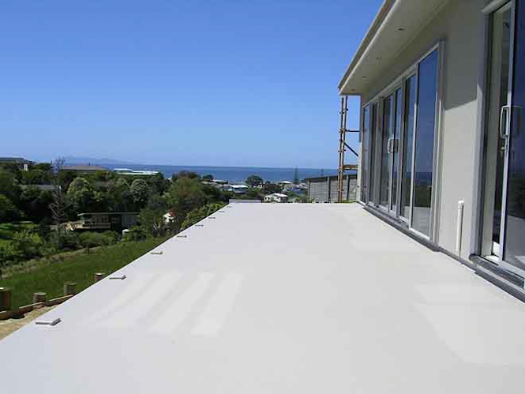
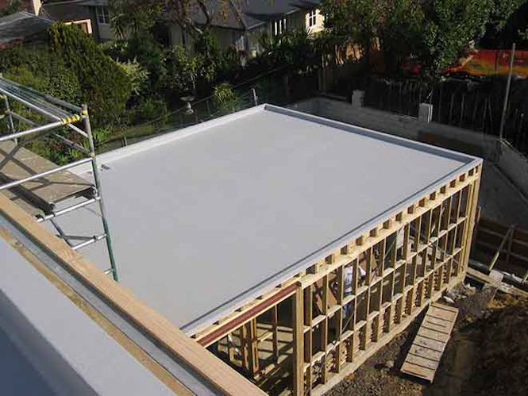

  

  

    <h4>Waterproofing the Greater Auckland Area, Waikato, and Bay of Plenty (for over 30 years)</h4>
  

  <section class="blue-dark-bg">
    

      

        
      

      

        <h5>Home & Residential Customers</h5>
        

          Above and below ground waterpoofing. Call on Total Waterproofing to waterpoof your roof, bathrooms, decks, floors, foundations, tanks, swimming pools, retaining walls, cow sheds and more.
        

      

    

  </section>

  <section class="blue-light-bg">
    

        

          
        

        

          <h5>Builders & Architects</h5>
          
We apply fibreglass reinforced systems, sheet applied membranes, specialist floor coatings, hi-build coatings, torch-on and more.

        

    

  </section>

