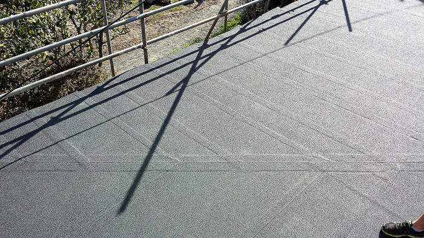

  <section>
    

      <h2 class="banner">Your professional waterproofers servicing Greater Auckland,  and Bay of Plenty</h2>
      

        
      

      

        We’ve been in the industry for over 30 years; advising clients, builders, and architects as to the viability of product application, followed by world class installation and service.
      

      

        We apply various waterproofing systems to residential and commercial buildings, whether it be new construction or renovation. We waterproof above and below ground, sealing, tanking, pools, roofs, decks, bathrooms and other interior wet areas.
      

      
    

  </section>

  <section class="blue-light-bg clearfix">
    

      

         
        
      

      

        <a href="torch-on-waterproofing-specialists">
          <h3>Torch-on Specialists</h3>
        </a>
        

          Choose a durable product expertly applied with care and precision for a stunning look. Talk to us about waterproofing with torch-on for your roof, deck, foundation, retaining walls, or sub-grade foundation.
        

        

          <a class="btn btn-primary" href="torch-on-waterproofing-specialists">Learn More</a>
        

      

    

  </section>

  <section class="blue-dark-bg clearfix">
    

      

        <h3>Floor Coatings</h3>
        

          Floor coatings are applied to concrete to prevent rising damp. We also do industrial flooring to garages, workshops, hospitals, cowshed, and other areas. We advise on the type of floor coatings to be used to accommodate for your needs and budget. All our waterproofers are approved applicators, and on job completion and full payment producer statements will be issued for council.
        

      

      

         
        
      

    

  </section>

  <section class="blue-light-bg clearfix">
    

      

         
        
      

      

        <h3>Fibreglass Decks and Flat Roofs</h3>
        

          Because of its durable qualities, versatility is a point of difference for our fibreglass reinforced system; here it is applied as a sleek finish for a deck area and rooftop.
        

        

          It provides a strong floor as well as keeping the underside dry and safe from water damage.
        

      

    

  </section>

  <section class="blue-dark-bg">
    

      <h3>All applications</h3>
      

        Above and below ground Waterproofing. Call on Total Waterproofing to waterproof your roof, bathrooms, decks, floors, foundations, tanks, swimming pools, retaining walls, cow sheds and more.
      

      

        We apply fibreglass reinforced systems, sheet applied membranes, specialist floor coatings, hi-build coatings, torch-on and more. Call us today to tell us about your waterproofing needs.
      

    

  </section>

